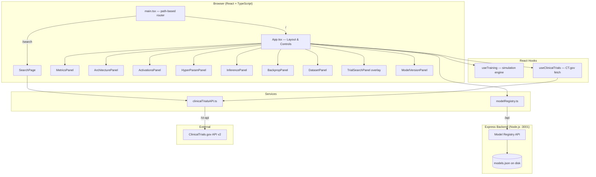
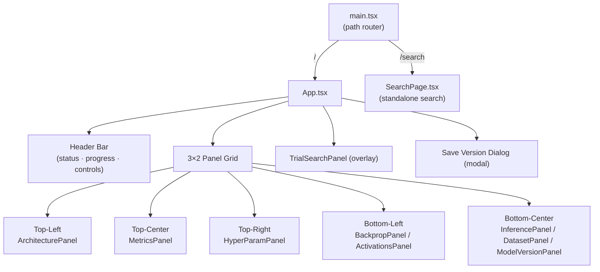
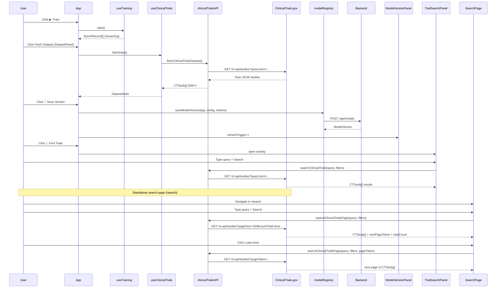

# ClinicalTrials Search Engine — DNN Dashboard

Two apps in one repository:

| App | URL | Description |
|---|---|---|
| **Clinical Trials Search** | `/search` | Standalone full-text search over the entire ClinicalTrials.gov database — no login required |
| **DNN Dashboard** | `/` | Interactive deep neural network training dashboard using real CT.gov data as its training set |

---

## Table of Contents

1. [Features](#features)
2. [Architecture](#architecture)
   - [System Architecture](#system-architecture)
   - [Frontend Component Tree](#frontend-component-tree)
   - [Data Flow](#data-flow)
   - [MLP Model Architecture](#mlp-model-architecture)
   - [Feature Engineering](#feature-engineering)
3. [Project Structure](#project-structure)
4. [Getting Started](#getting-started)
   - [Local Development](#local-development)
   - [Docker (Production)](#docker-production)
5. [Panel Reference](#panel-reference)
6. [API Reference](#api-reference)
   - [Model Registry API](#model-registry-api)
   - [ClinicalTrials.gov Proxy](#clinicaltrialsgov-proxy)
7. [Configuration](#configuration)
8. [Tech Stack](#tech-stack)

---

## Features

| Feature | Description |
|---|---|
| **Clinical Trials Search** | Standalone page at `/search` — search 500,000+ trials from ClinicalTrials.gov with filters, pagination, and "Load more" |
| **Live Training Simulation** | Epoch-by-epoch MLP training with configurable optimizer, scheduler, lr, batch size, dropout, and weight decay |
| **Real Clinical Trial Data** | Fetches 500+ studies from ClinicalTrials.gov API v2 and extracts 16 numerical features |
| **Model Version Registry** | Save, compare, restore, and annotate model checkpoints via a persistent Express backend |
| **Gradient Visualizer** | Per-layer gradient norm heatmap with vanishing/exploding gradient detection |
| **Activation Inspector** | Per-layer activation distribution histograms by epoch |
| **Architecture Diagram** | Interactive MLP SVG with clickable layers showing shape and parameters |
| **Inference Panel** | Run phase predictions on sample NCT IDs with probability bars and feature breakdowns |
| **Hyperparameter Controls** | Live-updating tuning panel; changing any hyperparameter triggers a retrain |

---

## Architecture

### System Architecture



### Frontend Component Tree



### Data Flow



### MLP Model Architecture

The simulated model is a 4-class tabular classifier predicting clinical trial phase (Phase I / II / III / IV).

```
Input (B, 16)
    │
    ▼
Dense 256  ──► BatchNorm ──► Dropout 0.3 ──► ReLU
    │
    ▼
Dense 128  ──► BatchNorm ──► Dropout 0.3 ──► ReLU
    │
    ▼
Dense 64   ──► ReLU
    │
    ▼
Dense 32   ──► ReLU
    │
    ▼
Dense 4 (output logits)
    │
    ▼
Softmax → P(Phase I | II | III | IV)
```

- **Input**: 16 normalized features from CT.gov study metadata
- **Hidden layers**: [256, 128, 64, 32] with BatchNorm + Dropout on first two
- **Output**: 4 logits → softmax probabilities over Phase I–IV
- **Loss**: Cross-entropy (simulated, initial ≈ −ln(0.25) = 1.386)
- **Optimizers**: Adam · AdamW · SGD · RMSProp · Adagrad
- **Schedulers**: CosineAnnealing · StepLR · OneCycleLR · ReduceOnPlateau · None

### Feature Engineering

16 numerical features are extracted from each CT.gov study:

| # | Feature | Description | Range |
|---|---|---|---|
| 1 | `log_enrollment` | `log1p(enrollment) / log1p(50000)` | 0–1 |
| 2 | `is_industry` | Sponsor class = INDUSTRY | 0/1 |
| 3 | `is_nih` | Sponsor class = NIH | 0/1 |
| 4 | `is_randomized` | RANDOMIZED=1, NON_RANDOMIZED=0.5, else=0 | 0–1 |
| 5 | `masking_score` | NONE=0 → QUADRUPLE=1 | 0, 0.25, 0.5, 0.75, 1 |
| 6 | `is_treatment` | Primary purpose = TREATMENT | 0/1 |
| 7 | `is_drug` | Intervention type = DRUG or BIOLOGICAL | 0/1 |
| 8 | `is_device` | Intervention type = DEVICE | 0/1 |
| 9 | `num_interventions` | `min(count, 5) / 5` | 0–1 |
| 10 | `num_outcomes` | `min(count, 10) / 10` | 0–1 |
| 11 | `num_conditions` | `min(count, 5) / 5` | 0–1 |
| 12 | `num_arms` | `min(count, 6) / 6` | 0–1 |
| 13 | `has_placebo` | "placebo" in eligibility criteria | 0/1 |
| 14 | `criteria_length` | `min(len / 5000, 1)` | 0–1 |
| 15 | `is_interventional` | Study type = INTERVENTIONAL | 0/1 |
| 16 | `has_biomarker` | "biomarker/genomic/mutation/variant" in title | 0/1 |

> Studies with phase = NA (observational, device, not-applicable) are excluded from training feature vectors but are included in search results.

---

## Project Structure

```
clinicaltrials/
├── src/
│   ├── App.tsx                   # DNN dashboard root layout, hooks wired, save dialog
│   ├── index.css                 # Global CSS variables (dark theme)
│   ├── main.tsx                  # React entry point + path-based router (/ vs /search)
│   │
│   ├── pages/
│   │   └── SearchPage.tsx        # Standalone clinical trials search (/search)
│   │
│   ├── hooks/
│   │   ├── useTraining.ts        # Training simulation engine (epoch stepper)
│   │   └── useClinicalTrials.ts  # CT.gov fetch + state management
│   │
│   ├── services/
│   │   ├── clinicalTrialsAPI.ts  # CT.gov API client, feature extractor, paginated search
│   │   └── modelRegistry.ts     # Model version CRUD (talks to Express backend)
│   │
│   └── panels/
│       ├── MetricsPanel.tsx      # SVG loss/accuracy charts
│       ├── ArchitecturePanel.tsx # Interactive MLP layer diagram
│       ├── ActivationsPanel.tsx  # Per-layer activation histograms
│       ├── BackpropPanel.tsx     # Gradient norm heatmap + vanishing/exploding alerts
│       ├── HyperParamPanel.tsx   # Hyperparameter sliders/dropdowns
│       ├── InferencePanel.tsx    # Phase prediction on sample NCT IDs
│       ├── DatasetPanel.tsx      # CT.gov dataset browser + statistics
│       ├── TrialSearchPanel.tsx  # In-dashboard search overlay (quick access)
│       └── ModelVersionPanel.tsx # Saved version list + restore
│
├── server/
│   ├── index.js                  # Express model registry REST API
│   ├── package.json
│   └── Dockerfile                # node:20-alpine, port 3001
│
├── Dockerfile                    # Multi-stage: node:20-alpine → nginx:1.27-alpine
├── docker-compose.yml            # frontend + backend + model-data volume
├── nginx.conf                    # SPA fallback + /ct-api rewrite proxy + /api variable proxy
├── vite.config.ts                # Dev proxies: /ct-api → CT.gov, /api → :3001
└── package.json
```

---

## Getting Started

### Local Development

**Prerequisites**: Node.js ≥ 20, npm

```bash
# 1. Install frontend dependencies
npm install

# 2. Install backend dependencies
cd server && npm install && cd ..

# 3. Start the model registry backend
DATA_DIR=/tmp/clinicaltrials-models node server/index.js &

# 4. Start the Vite dev server
npm run dev -- --port 5174
```

Open **http://localhost:5174** for the DNN dashboard, **http://localhost:5174/search** for the search page.

The Vite dev server proxies:
- `/ct-api/*` → `https://clinicaltrials.gov/api/v2/*`
- `/api/*` → `http://localhost:3001/*`

### Docker (Production)

```bash
# Build and start both containers
docker compose up --build -d

# Open DNN dashboard
open http://localhost:8080

# Open standalone search
open http://localhost:8080/search

# Stop (model data persists in named volume)
docker compose down

# Stop and delete all saved models
docker compose down -v
```

The `model-data` named Docker volume keeps `models.json` alive across restarts and redeployments.

---

## Panel Reference

### SearchPage (standalone — `/search`)
Full-page clinical trials search accessible to any user without the DNN dashboard.
- Searches the **entire** ClinicalTrials.gov database (500,000+ trials) in real time
- **100 results per page** with cursor-based **Load more** pagination via `pageToken`
- Displays total match count from CT.gov alongside a per-phase breakdown
- Filters: phase (I–IV), recruitment status, sponsor class
- Keyword highlighting in result titles, expandable detail cards, direct CT.gov links
- Navigates back to the dashboard via the header link

### MetricsPanel
Two SVG line charts updating in real-time each epoch:
- **Loss** — training loss (solid) and validation loss (dashed)
- **Accuracy** — training accuracy (solid) and validation accuracy (dashed)

### ArchitecturePanel
Interactive SVG of the MLP layers. Click any node to see layer type, output shape `(B, n)`, and parameter count. Legend shows Dense / BatchNorm / Dropout / Input / Output layer types.

### BackpropPanel
Per-layer gradient norm heatmap showing gradient magnitude from output → input across all epochs. Annotates:
- 🔴 **Vanishing gradients** (norm < 1e-5)
- 🟠 **Exploding gradients** (norm > 10)

### ActivationsPanel
Histogram of activation distributions per layer. Shows whether layers are saturating or learning useful representations.

### HyperParamPanel
Sliders and dropdowns for all training hyperparameters. Any change resets training and begins a new run.

| Parameter | Default | Range |
|---|---|---|
| Learning rate | 0.001 | 1e-4 – 0.1 |
| Batch size | 64 | 8 – 512 |
| Dropout | 0.3 | 0 – 0.9 |
| Weight decay | 0.0001 | 0 – 0.01 |
| Momentum | 0.9 | 0.5 – 0.999 |
| Max epochs | 60 | 10 – 200 |
| Optimizer | Adam | Adam, AdamW, SGD, RMSProp, Adagrad |
| Scheduler | CosineAnnealing | CosineAnnealing, StepLR, OneCycleLR, ReduceOnPlateau, None |

### DatasetPanel
- **Fetch** 500+ studies from ClinicalTrials.gov across targeted search queries
- **Phase distribution** (Phase I / II / III / IV / N/A) with counts and percentages
- **Feature importance** bar chart (simulated)
- **Study browser** — scroll through individual studies

### TrialSearchPanel (dashboard overlay)
Quick-access slide-in drawer opened via the **⊞** icon in the dashboard header. Live search only (no local-dataset mode).

Filter chips: phase (I–IV), recruitment status, sponsor class. Cards expand to show study attributes and link to CT.gov.

For a full unbounded search experience use the **[standalone search page](#searchpage-standalone----search)** at `/search`.

### InferencePanel
Runs phase predictions on 6 pre-loaded NCT IDs. Shows predicted phase, confidence %, probability bars for all 4 phases, and feature contribution pills.

### ModelVersionPanel
Manages saved model checkpoints:
- Lists all versions (newest first) with tag, date, val accuracy
- Expand any version to see full config + metrics
- **Restore** — loads config and triggers a retrain
- **Edit notes** — inline editor synced to registry
- **Delete** — removes version permanently

---

## API Reference

### Model Registry API

Base URL: `/api` (proxied to Express backend in both dev and Docker)

#### `GET /api/models`
List all saved versions, newest first.

#### `POST /api/models`
Save a new version. `tag` auto-generates as `v1.0`, `v1.1`, … if omitted.

```json
{
  "tag": "my-experiment",
  "notes": "optional",
  "config": { "lr": 0.001, "batchSize": 64, "dropout": 0.3, "wd": 0.0001, "momentum": 0.9, "maxEpochs": 60, "optimizer": "Adam", "scheduler": "CosineAnnealing" },
  "metrics": { "finalLoss": 0.41, "finalAcc": 0.85, "finalValLoss": 0.49, "finalValAcc": 0.82, "epoch": 60, "lr": 0.000031 },
  "datasetSize": 523
}
```

Returns `201 Created` or `409 Conflict` (duplicate tag).

#### `DELETE /api/models/:id`
Remove by UUID. Returns `204 No Content`.

#### `PATCH /api/models/:id`
Update notes: `{ "notes": "updated text" }`.

#### `GET /api/health`
Returns `{ "status": "ok", "models": <count> }`.

---

### ClinicalTrials.gov Proxy

Both Vite (`rewrite` in `vite.config.ts`) and nginx (`rewrite+break` in `nginx.conf`) proxy `/ct-api/*` → `https://clinicaltrials.gov/api/v2/*`.

> **nginx note**: A `rewrite ^/ct-api/(.*)$ /api/v2/$1 break` rule is used instead of path-in-`proxy_pass` because nginx disables automatic path substitution when the `proxy_pass` URL contains a variable.

**Search studies (single page)**:
```
GET /ct-api/studies?query.term=ketamine&pageSize=100&format=json&countTotal=true
```

**Paginate to next page**:
```
GET /ct-api/studies?query.term=ketamine&pageSize=100&format=json&countTotal=true&pageToken=<token>
```

Response shape:
```json
{ "studies": [...], "nextPageToken": "abc123", "totalCount": 4821 }
```

Full API reference: https://clinicaltrials.gov/data-api/api

---

## Configuration

### Backend environment variables

| Variable | Default | Description |
|---|---|---|
| `PORT` | `3001` | Express server port |
| `DATA_DIR` | `/data` | Directory for `models.json` storage |

### CSS design tokens (`src/index.css`)

| Variable | Value | Usage |
|---|---|---|
| `--bg` | `#0d0f1a` | Page background |
| `--surface` | `#13162a` | Card backgrounds |
| `--surface2` | `#1b1f35` | Input / chip backgrounds |
| `--border` | `#252944` | All borders |
| `--accent` | `#6366f1` | Primary indigo |
| `--accent2` | `#22d3ee` | Cyan / secondary |
| `--accent3` | `#f43f5e` | Danger / stop |
| `--text` | `#e2e8f0` | Primary text |
| `--text-muted` | `#64748b` | Labels and metadata |

---

## Tech Stack

| Layer | Technology |
|---|---|
| Framework | React 19 + TypeScript (Vite 8) |
| Charts | Custom SVG (MetricsPanel), Recharts (ActivationsPanel) |
| Flow diagram | @xyflow/react |
| Backend | Node.js 20 + Express 4 |
| Persistence | JSON file (atomic write via tmp + rename) |
| Containerization | Docker multi-stage + Docker Compose |
| Web server | nginx 1.27 (alpine) |
| Linter | oxlint |
| Clinical data | ClinicalTrials.gov REST API v2 |
